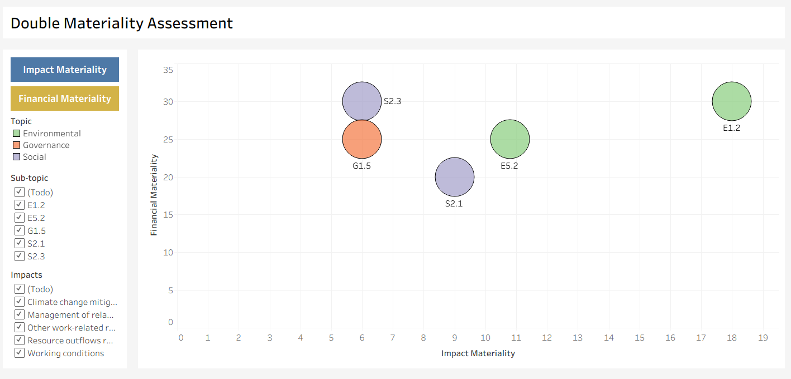
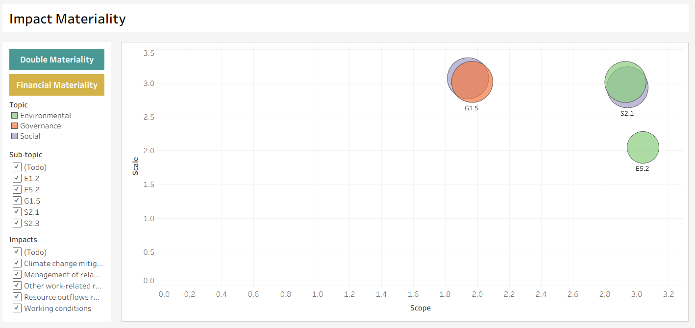
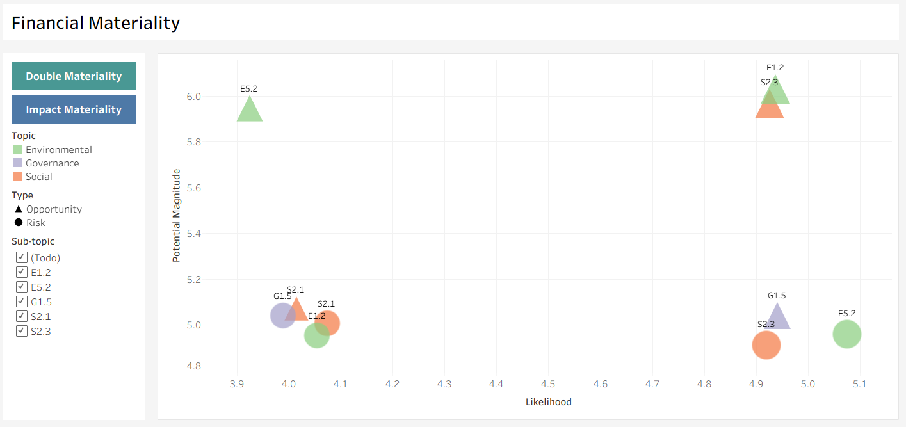

# Double Materiality Assessment Dashboard

An interactive, data-driven ESG project analyzing sustainability topics through a Double Materiality framework of Lindex Group. Built using **Tableau** and **Excel** in compliance with the **European Sustainability Reporting Standards (ESRS)**.

## 🎯 Project Overview
This repository contains a dynamic **Double Materiality Assessment Dashboard** designed to evaluate corporate sustainability topics. The project maps out environmental, social, and governance (ESG) impacts across two distinct dimensions:
* **Impact Materiality:** The organization's impact on people and the environment.
* **Financial Materiality:** Sustainability-related financial risks and opportunities affecting the organization's value.

## 📊 Dashboard
The dashboard is split into three interconnected views with custom UI buttons that allow users to navigate flawlessly between perspectives:

1. **Main Matrix (`image_2ddc38.png`):** Shows the consolidated Double Materiality perspective, mapping overall Impact and Financial scores

2. **Impact Materiality Perspective (`image_2ddc01.png`):** Maps the possible impacts by Scale and Scope.

3. **Financial Materiality Perspective (`image_2ddb47.png`):** Displays potential Business Risks and Opportunities categorized by Likelihood and Potential Magnitude.

## ⚖️ Framework Selection: Why ESRS?
A key element of this project was choosing the right regulatory architecture. While frameworks like GRI and SASB are widely respected, **ESRS** was selected for this assessment due to the following reasons:

* 📜 **CSRD Mandate Alignment:** Under the EU Corporate Sustainability Reporting Directive (CSRD), the **ESRS** introduces a mandatory, legally binding obligation for Double Materiality. GRI and SASB remain voluntary disclosures.
* 🔗 **True Double Materiality Integration:** 
  * **GRI** historically focuses almost exclusively on *Impact Materiality*.
  * **SASB** focuses primarily on *Financial Materiality*.
  * **ESRS** legally harmonizes both dimensions into a strict, unified scoring matrix.
* 📊 **Rigor & Auditability:** ESRS sets strict quantitative boundaries and precise disclosure requirements that convert qualitative corporate risks into auditable data streams.

## 🛠️ Data Visualization Techniques
When plotting sustainability scores (such as Likelihood or Scale from 1 to 5), multiple ESG topics often end up with identical coordinates. In a standard scatterplot, this creates **overlapping marks**, hiding crucial data points.

To solve this issue and ensure complete transparency, **Jittering ** was applied in Tableau:
* 💻 **The Code:** A controlled, randomized offset was added to the data's X and Y coordinates inside the Tableau calculated fields (e.g., `[Scale Value] + ((RANDOM() - 0.5) * 0.15)`).
* 🎯 **The Result:** Marks with identical scores are gently separated from each other horizontally or vertically. This avoids data clustering, exposes overlapping variables, and ensures every single ESG risk is fully visible to decision-makers.

## 🌐 Data & Scoring Model
The matrix structure is powered by an Excel data model mapped according to European standards:
* 📋 **Dataset Details:** Organizes disclosures across Environmental, Social, and Governance main pillars, broken down into numbered sub-topics (e.g., Climate Change, Working Conditions, Resource Outflows).
* 🧮 **Scoring:** I simulate the stakeholder feedback data based on previous financial and ESG annual reports of Lindex for: **Scale**, **Scope**, **Remediability**, **Likelihood**, and **Magnitude** to generate final coordinates.
* 🔀 **Shape Mappings:** Risks are represented as circles (`●`) and Opportunities as triangles (`▲`), allowing executive boards to differentiate threats from opportunities.

## 💡 Key Business Conclusions
* 🚨 **High-Priority Focus (Top Right):** Sub-topic `E1.2` (Pollution of Water) stands out as highly material on both axes, signaling an immediate need for capital allocation toward mitigation strategies for water pollution. This problem is key due to the textile nature of the company.
* 🌍 **Climate Growth:** While greenhouse gas emissions are a big issue, cutting emissions is a huge business opportunity. It allows the company to get sustainable funding (like green bonds) and gives it a stronger, better brand image than competitors.
* 🔄 **Fixing Waste Risks:** Manufacturing waste and using raw materials create high risks due to strict new European laws. To comply with these laws, Lindex must move fast toward a circular model, which will also lower material costs over time.

## 🛠️ Tools
* **Visualization:** Tableau Desktop / Public 📊 (Utilizing dynamic sheet-swapping, shapes, and jittered coordinate plots)
* **Framework Methodology:** ESRS (European Sustainability Reporting Standards) 🌿
* **Data Prep & Model:** Microsoft Excel 🧮

## 🎮 How to Interact with the Dashboard
1. Download the [Dataset](DMALindexGroup.xlsx).
2. 2. Download and open the [Tableau](DMALindexGroup.twbx) file using Tableau Desktop or [Tableau Public](https://public.tableau.com/app/profile/adalberto.rosendo.vargas/viz/DMALindexGroup/DoubleM).
3. Click the **Blue button (Impact Materiality)** or the **Yellow button (Financial Materiality)** to navigate between the parts of the assessment.
4. Click the **Teal button (Double Materiality)** to return to the main matrix.
5. Filter by specific sub-topics or impacts via the interactive side panels.

---
*Developed by Adalberto Rosendo Vargas* 🚀
